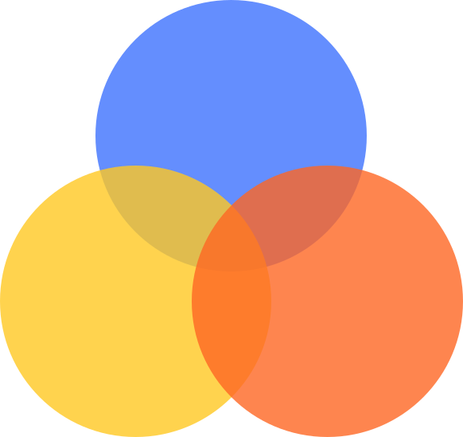

<!-- Don't delete it -->

<!-- Organization Logo -->

  
  
  

&nbsp;

<!-- Organization Name -->

<!-- Organization/Project Social Handles -->

<!-- Telegram -->

&nbsp;&nbsp;
<!-- X (formerly Twitter) -->

&nbsp;&nbsp;
<!-- Discord -->

&nbsp;&nbsp;
<!-- Medium -->

&nbsp;&nbsp;
<!-- LinkedIn -->

&nbsp;&nbsp;
<!-- Youtube -->

&nbsp;
<!-- Project core values and objective -->

  <strong>
  An open-source SDK  
  empowering you to directly accept  
  cryptocurrency and stablecoin payments
  free from centralized fintech infrastructure    
  </strong>

---

<!-- Project Description (Start from here) -->

StablePay is a fully decentralized solution for online payments. 
When the StablePay widget is embedded in a website, the widget interacts 
directly with smart contracts on blockchains, with no intermediary servers.

StablePay allows payments to be made either via the native cryptocurrency 
of the underlying blockchain or via decentralized stablecoins backed by these native currencies.
StablePay also allows automatic conversion between the two. For example, a consumer may pay using 
a native cryptocurrency, but the merchant receives the payment in a stablecoin backed by that cryptocurrency.
The conversion happens automatically, by interacting with the stablecoin contract to mint stablecoins.

Currently, stablecoins based on the [Djed stablecoin protocol](https://djed.one) deployed on EVM-compatible chains are supported.

## **Code Structure Overview**

The StablePay widget itself is located in the [stablepay-sdk folder](https://github.com/DjedAlliance/StablePay/tree/main/stablepay-sdk). It makes use of the Djed SDK to interact with Djed stablecoin contracts. The Djed SDK is located in the [djed-sdk folder](https://github.com/DjedAlliance/StablePay/tree/main/djed-sdk). 

The main files of the Djed SDK and their purposes are:

* [djed/stableCoin.js](https://github.com/DjedAlliance/StablePay/blob/main/djed-sdk/src/djed/stableCoin.js) - contains functions to build transations that buy and sell stablecoins.
* [djed/reserveCoin.js](https://github.com/DjedAlliance/StablePay/blob/main/djed-sdk/src/djed/reserveCoin.js) - contains functions to build transations that buy and sell reservecoins.
* [djed/djed.js](https://github.com/DjedAlliance/StablePay/blob/main/djed-sdk/src/djed/djed.js) - contains functions to connect to the Djed contracts and to the ERC20 contracts for the stablecoins and reservecoins.
* [djed/system.js](https://github.com/DjedAlliance/StablePay/blob/main/djed-sdk/src/djed/system.js) - contains functions to fetch the parameters and state variables of the Djed contracts and of the user.
* [oracle/oracle.js](https://github.com/DjedAlliance/StablePay/blob/main/djed-sdk/src/oracle/oracle.js) - contains functions to connect to the oracle contract used by a Djed contract.
* [constants.js](https://github.com/DjedAlliance/StablePay/blob/main/djed-sdk/src/constants.js) - contains configuration constants.
* [web3.js](https://github.com/DjedAlliance/StablePay/blob/main/djed-sdk/src/web3.js) - handles wallet connection.

The main files of the StablePay widget and their purposes are:

* [widget/Widget.jsx](https://github.com/DjedAlliance/StablePay/blob/main/stablepay-sdk/src/widget/Widget.jsx) - contains the main widget component.
* [widget/PayButton.jsx](https://github.com/DjedAlliance/StablePay/blob/main/stablepay-sdk/src/widget/PayButton.jsx) - contains the `Pay with StablePay" button component.
* [widget/NetworkDropdown.jsx](https://github.com/DjedAlliance/StablePay/blob/main/stablepay-sdk/src/widget/NetworkDropdown.jsx) - contains the widget's subcomponent that allows customers to select the blockchain network that they would like to use for the payment.
* [widget/TokenDropdown.jsx](https://github.com/DjedAlliance/StablePay/blob/main/stablepay-sdk/src/widget/TokenDropdown.jsx) - contains the widget's subcomponent that allows customers to select the token (native cryptocurrency or stablecoin) that they would like to use for the payment.
* [widget/TransactionReview.jsx](https://github.com/DjedAlliance/StablePay/blob/main/stablepay-sdk/src/widget/TransactionReview.jsx) - contains the widget's subcomponent that constructs the transaction, shows it to costumer and allows the customer to connect a wallet and submit the transaction.

## **Using the StablePay Widget**

A simple example merchant website with the StablePay widget embedded is available in the [StablePay-MerchantWebsiteDemo](https://github.com/DjedAlliance/StablePay-MerchantWebsiteDemo).

<!-- Use Back Button after each section -->

<kbd><a href="#readme-top">↑ Back to top ↑</a></kbd>

---

<!-- Don't delete it -->
<!-- Funding Badge -->

<a href="https://docs.stability.nexus/about-us/fund-us">Fund This Project</a>

